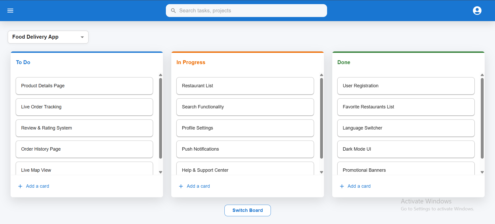
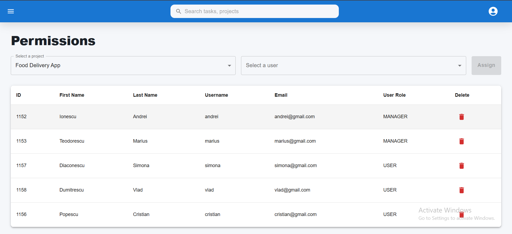
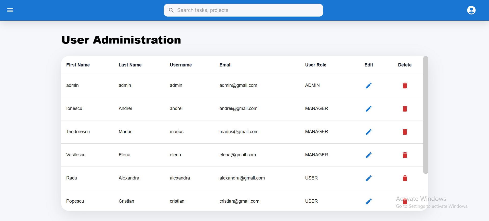
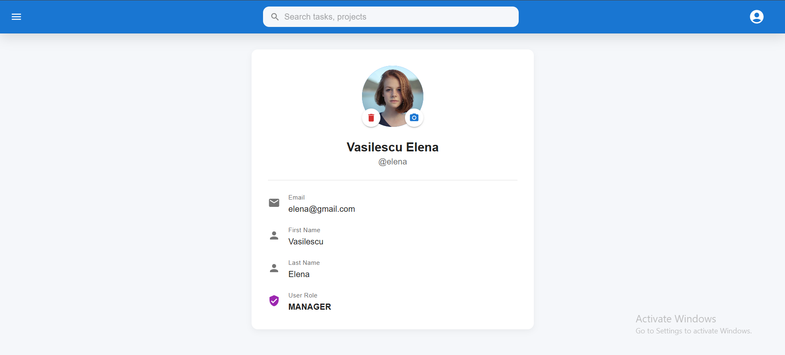
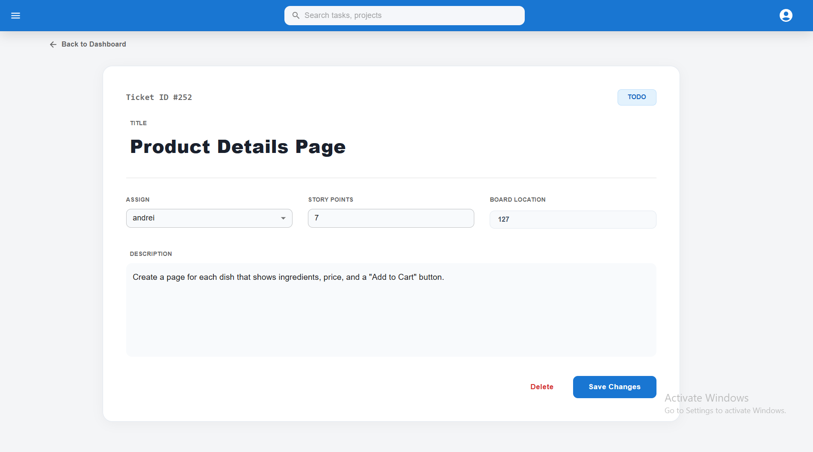

<h1 align="center"><strong><em>TicketTracker - Kanban Management System</strong></em></h1>

  

# 📖 Overview

**TicketTracker** is a professional task management application built with **Spring Boot** and **React**. It features a dynamic Kanban board, multi-language support (i18n), and a robust administrative system for project assignments and user management.

# 🚀 How to run the app?

### Backend (Spring Boot)

* Create a MySQL schema named `kanban_db`.

* Update `src/main/resources/application.properties` with your DB username and password.

* Run the application using your IDE or `./mvnw spring-boot:run`.

### Frontend (React)

* Navigate to the frontend folder: `cd frontend`

* Install dependencies: `npm install`

* Start the app: `npm start`

---

<h1 align="center"><strong>Demonstration</strong></h1>

<h2 align="center"><strong>🚀 Main Dashboard</strong></h2>

  
   
   
  <em>Manage your tasks effortlessly across <code>TODO</code>, <code>In Progress</code>, and <code>DONE</code> columns with a clean, intuitive Kanban interface.</em>

<h2 align="center"><strong>🔐 Admin Permissions & Security</strong></h2>

<table align="center">
  <tr>
    <td align="center" valign="top" width="50%">
      
       
      <strong>Project Permissions</strong>
      
Assign users to specific projects.

    </td>
    <td align="center" valign="top" width="50%">
      
       
      <strong>User Management</strong>
      
Admins can register new members and manage system access.

    </td>
  </tr>
</table>

<h2 align="center"><strong>User & Ticket Details</strong></h2>
<table align="center">
  <tr>
    <td align="center">
       
      <em>User Settings & Profile</em>
    </td>
    <td align="center">
       
      <em>Detailed Ticket View</em>
    </td>
  </tr>
</table>

---

## ✨ Key Features

* **Full CRUD:** Create, edit, and delete Projects, Boards, and Tickets.

* **Role-Based Access:** Specialized views for Admins, Managers, and Users.

* **Internationalization:** Easily switch between languages (i18n).

* **Profile Management:** Users can update their avatars and view personal information.

## 🛠️ Tech Stack

* **Frontend:** React.js, i18next, Material UI.

* **Backend:** Java, Spring Boot, Maven, Spring Security (JWT/Session).

* **Database:** MySQL / Hibernate JPA.
